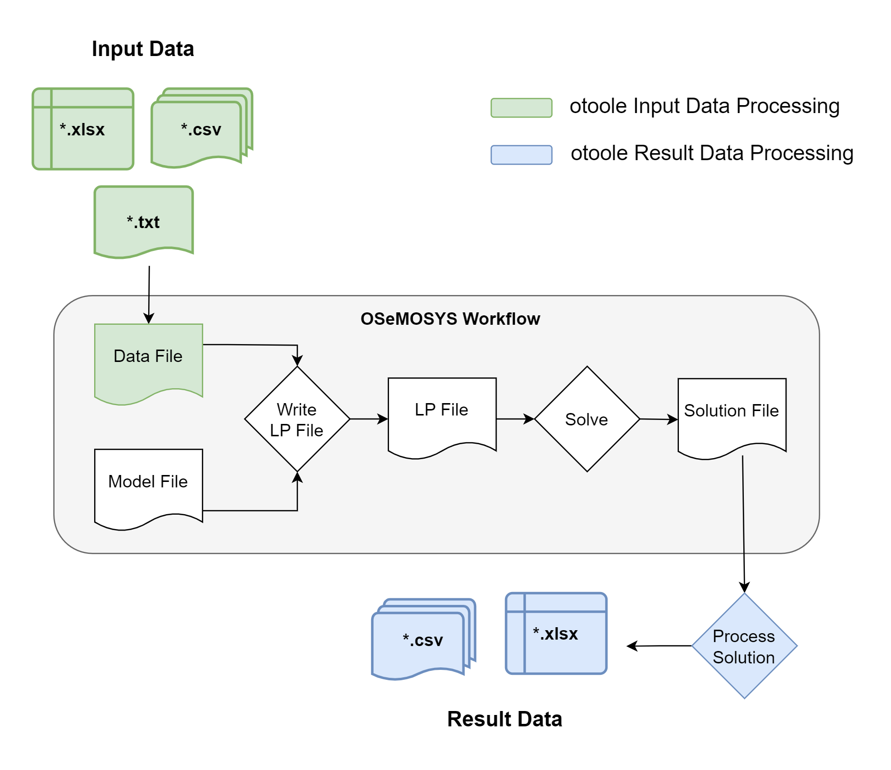

==================================================
otoole: OSeMOSYS tools for energy work
==================================================

.. image:: https://joss.theoj.org/papers/e93a191ae795b171beff782a68fdc467/status.svg
    :target: https://joss.theoj.org/papers/e93a191ae795b171beff782a68fdc467
    :alt: JOSS status

.. image:: https://img.shields.io/pypi/v/otoole.svg
    :target: https://pypi.org/project/otoole/
    :alt: PyPI

.. image:: https://img.shields.io/badge/code%20style-black-000000.svg
    :target: https://github.com/psf/black
    :alt: Code Style

.. image:: https://img.shields.io/badge/python-3.9_|_3.10_|_3.11|_3.12-blue.svg
    :target: https://crate.io/packages/otoole/
    :alt: Python Version

.. image:: https://img.shields.io/badge/License-MIT-green.svg
    :target: https://opensource.org/licenses/MIT
    :alt: License

|

.. image:: https://coveralls.io/repos/github/OSeMOSYS/otoole/badge.svg?branch=master&kill_cache=1
    :target: https://coveralls.io/github/OSeMOSYS/otoole?branch=master
    :alt: Code Coverage

.. image:: https://github.com/OSeMOSYS/otoole/actions/workflows/python.yaml/badge.svg?branch=master
    :target: https://github.com/OSeMOSYS/otoole/actions/workflows/python.yaml
    :alt: GitHub CI

.. image:: https://readthedocs.org/projects/otoole/badge/?version=latest
    :target: https://otoole.readthedocs.io/en/latest/?badge=latest
    :alt: Documentation Status

Description
===========

OSeMOSYS tools for energy work, or otoole, is a Python package
to support the users of OSeMOSYS. The aim of the package is to provide commonly
used pre- and post-processing steps for OSeMOSYS.

**otoole** aims to support different ways of storing input data and results,
including csv files and Excel workbooks, as well as different implementations
of the OSeMOSYS model. This improves interoperability of analyses and
generally makes life a little bit easier.

Installation
============

``otoole`` can be installed through ``pip``::

    pip install otoole

For instructions of the use of the tool, run the command line help function::

    otoole --help

Documentation
=============
Detailed documentation of otoole, including examples, can be found here:
https://otoole.readthedocs.io/en/latest/

Contributing
============

New ideas and bugs `should be submitted <https://github.com/OSeMOSYS/otoole/issues/new>`_
to the repository issue tracker. Please do contribute by discussing and developing these
ideas further.

To contribute directly to the code and documentation development, please see
the `contribution guidelines <https://otoole.readthedocs.io/en/latest/contributing.html>`_.
