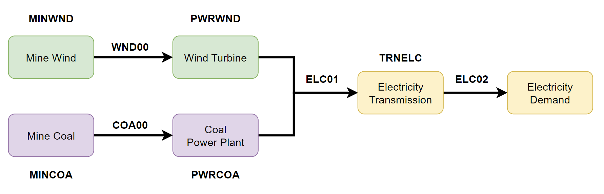

.. _examples:

--------
Examples
--------

This page will present examples to show the full functionality of ``otoole``. It will
walk through the ``convert``, ``results``, ``setup``, ``viz`` and ``validate``
functionality in seperate simple use cases.

.. NOTE::
    To follow these examples, clone the Simplicity_ repository and run all commands
    from the ``simplicity/`` directory::

        git clone https://github.com/OSeMOSYS/simplicity.git
        cd simplicity

.. CAUTION::
    While ``otoole`` does not require a solver, these examples
    will use the free and open source solvers GLPK_ and CBC_.
    Installation instructions are described in the `Solver Setup`_ section.

Data Conversion with CSVs
-------------------------

Objective
~~~~~~~~~

Use a folder of CSV data to build and solve an OSeMOSYS model with CBC_. Generate
the full suite of OSeMOSYS results.

1. ``otoole`` Convert
~~~~~~~~~~~~~~~~~~~~~
We first want to convert the folder of Simplicity_ CSVs into
an OSeMOSYS datafile called ``simplicity.txt``::

    $ otoole convert csv datafile data simplicity.txt config.yaml

2. Build the Model
~~~~~~~~~~~~~~~~~~~
Use GLPK_ to build the model and save it as ``simplicity.lp``::

    $ glpsol -m OSeMOSYS.txt -d simplicity.txt --wlp simplicity.lp --check

.. TIP::
    See the `GLPK Wiki`_ for more information on the ``glpsol`` command

3. Solve the Model
~~~~~~~~~~~~~~~~~~
Use CBC_ to solve the model and save the solution file as ``simplicity.sol``::

    $ cbc simplicity.lp solve -solu simplicity.sol

4. Generate the full set of results
~~~~~~~~~~~~~~~~~~~~~~~~~~~~~~~~~~~
Use ``otoole``'s ``result`` package to generate the results file::

    $ otoole results cbc csv simplicity.sol results config.yaml

5. View Results
~~~~~~~~~~~~~~~
Results are now viewable in the files ``results/*.csv``

.. TIP::
    Before moving onto the next section, remove all the generated files::

        $ rm simplicity.lp simplicity.sol simplicity.txt results/*

Data Conversion with Excel
--------------------------

Objective
~~~~~~~~~

Use an excel worksheet to build and solve an OSeMOSYS model with CBC.

1. Create the Excel Workbook
~~~~~~~~~~~~~~~~~~~~~~~~~~~~
Use the example CSV data to create an Excel Workbook using ``otoole convert``::

    $ otoole convert csv excel data simplicity.xlsx config.yaml

Excel workbooks are an easy way for humans to interface with OSeMOSYS data!

2. Create the MathProg datafile
~~~~~~~~~~~~~~~~~~~~~~~~~~~~~~~
Next, we want to convert the excel workbook (``simplicity.xlsx``) into
an OSeMOSYS datafile (``simplicity.txt``)::

    $ otoole convert excel datafile simplicity.xlsx simplicity.txt config.yaml

3. Build the Model
~~~~~~~~~~~~~~~~~~
Use GLPK_ to build the model and save it as ``simplicity.lp``::

    $ glpsol -m OSeMOSYS.txt -d simplicity.txt --wlp simplicity.lp --check

4. Solve the Model
~~~~~~~~~~~~~~~~~~
Use CBC_ to solve the model and save the solution file as ``simplicity.sol``::

    $ cbc simplicity.lp solve -solu simplicity.sol

5. Generate the selected results
~~~~~~~~~~~~~~~~~~~~~~~~~~~~~~~~
Use ``otoole``'s ``result`` package to generate the result CSVs::

    $ otoole results cbc csv simplicity.sol results config.yaml

Model Visualization
-------------------

Objective
~~~~~~~~~

Use ``otoole`` to visualize the reference energy system.

1. ``otoole`` Visualise
~~~~~~~~~~~~~~~~~~~~~~~
The visualization functionality of ``otoole`` will work with any supported
input data format (``csv``, ``datafile``, or ``excel``). In this case, we will
use the excel file, ``simplicity.xlsx``, to generate the RES.

Run the following command, where the RES will be saved as the file ``res.png``::

    $ otoole viz res excel simplicity.xlsx res.png config.yaml

2. View the RES
~~~~~~~~~~~~~~~
Open the newly created file, ``res.png`` and the following image should be
displayed

.. image:: _static/simplicity_res.png

Template Setup
--------------

Objective
~~~~~~~~~

Generate a template configuration file and excel input file to use with
``otoole convert`` commands

1. Create the Configuration File
~~~~~~~~~~~~~~~~~~~~~~~~~~~~~~~~
Run the following command, to create a template configuration file
called ``config.yaml``::

    $ otoole setup config template_config.yaml

2. Create the Template Data CSVs
~~~~~~~~~~~~~~~~~~~~~~~~~~~~~~~~
``otoole`` will only generate template CSV data, however, we want to input
data in Excel format. Therefore, we will first generate CSV data and convert
it to Excel format::

    $ otoole setup csv template_data

3. Add Year Definitions
~~~~~~~~~~~~~~~~~~~~~~~
Open up the the file ``template_data/YEARS.csv`` and add all the years over the model
horizon. For example, if the model horizon is from 2020 to 2050, the
``template_data/YEARS.csv`` file should be formatted as follows:

+---------+
| VALUE   |
+=========+
| 2020    |
+---------+
| 2021    |
+---------+
| 2022    |
+---------+
| ...     |
+---------+
| 2050    |
+---------+

.. NOTE::
   While this step in not technically required, by filling out the years in
   CSV format, ``otoole`` will pivot all the Excel sheets on the years
   during the conversion process. This will save significant formatting time!

4. Convert the CSV Template Data
~~~~~~~~~~~~~~~~~~~~~~~~~~~~~~~~
To convert the template CSV data into Excel formatted data, run the following
``convert`` command::

    $ otoole convert csv excel template_data template.xlsx template_config.yaml

5. Add Model Data
~~~~~~~~~~~~~~~~~
There should now be a file called ``template.xlsx`` that the user can open and
add data to.

Model Validation
----------------

.. NOTE::
    In this example, we will use a very simple model instead of the
    Simplicity_ demonstration model. This way the user does not need to be
    familar with the naming convenations of the model.

Objective
~~~~~~~~~

Use ``otoole`` to validate an input data file. The model
we are going to validate is shown below, where the fuel and technology
codes are shown in bold face.

1. Create the Validation File
~~~~~~~~~~~~~~~~~~~~~~~~~~~~~
Create a configuration validation ``yaml`` file::

    $ touch validate.yaml

2. Create ``FUEL`` Codes
~~~~~~~~~~~~~~~~~~~~~~~~
Create the fuel codes and descriptions in the validation configuration file::

    codes:
      fuels:
        'WND': Wind
        'COA': Coal
        'ELC': Electricity
      indetifiers:
        '00': Raw Resource
        '01': Intermediate
        '02': End Use

3. Create ``TECHNOLOGY`` Codes
~~~~~~~~~~~~~~~~~~~~~~~~~~~~~~
Add the technology codes to the validation configuration file. Note that the
powerplant types are the same codes as the fuels, so there is no need to
redefine these codes::

    codes:
      techs:
        'MIN': Mining
        'PWR': Generator
        'TRN': Transmission

4. Create ``FUEL`` Schema
~~~~~~~~~~~~~~~~~~~~~~~~~
Use the defined codes to create a schema for the fuel codes::

    schema:
      FUEL:
      - name: fuel_name
          items:
          - name: fuels
          valid: fuels
          position: (1, 3)
          - name: indetifiers
          valid: indetifiers
          position: (4, 5)

5. Create ``TECHNOLOGY`` Schema
~~~~~~~~~~~~~~~~~~~~~~~~~~~~~~~
Use the defined codes to create a schema for the technology codes::

    schema:
      TECHNOLOGY:
      - name: technology_name
          items:
          - name: techs
          valid: techs
          position: (1, 3)
          - name: fuels
          valid: fuels
          position: (4, 6)

6. ``otoole`` validate
~~~~~~~~~~~~~~~~~~~~~~
Use otoole to validate the input data (can be any of a ``datafile``, ``csv``, or ``excel``)
against the validation configuration file::

    $ otoole validate datafile data.txt config.yaml --validate_config validate.yaml

.. WARNING::
    Do not confuse the user configuation file (``config.yaml``) and the
    validation configuation file (``validate.yaml``). Both configuartion files
    are required for validation functionality.

The final validation configuration file in this example will look like::

    codes:
      fuels:
        'WND': Wind
        'COA': Coal
        'ELC': Electricity
      indetifiers:
        '00': Raw Resource
        '01': Intermediate
        '02': End Use
      techs:
        'MIN': Mining
        'PWR': Generator
        'TRN': Transmission

    schema:
      FUEL:
      - name: fuel_name
          items:
          - name: fuels
          valid: fuels
          position: (1, 3)
          - name: indetifiers
          valid: indetifiers
          position: (4, 5)
      TECHNOLOGY:
      - name: technology_name
          items:
          - name: techs
          valid: techs
          position: (1, 3)
          - name: fuels
          valid: fuels
          position: (4, 6)

Solver Setup
------------

Objective
~~~~~~~~~

Install GLPK_ and CBC_ to use in the otoole examples.

1. Install GLPK
~~~~~~~~~~~~~~~~

GLPK_ is a free and open-source linear program solver.

To install it on **Linux**, run the command::

    sudo apt-get update
    sudo apt-get install glpk glpk-utils

To install it on **Mac**, run the command::

    brew install glpk

.. To install it on **Windows**, follow the install instruction on the GLPK_
.. website, and/or follow the instructions_ from the OSeMOSYS community

2. Test the GLPK install
~~~~~~~~~~~~~~~~~~~~~~~~
Once installed, you should be able to call the ``glpsol`` command::

    $ glpsol
    GLPSOL: GLPK LP/MIP Solver, v4.65
    No input problem file specified; try glpsol --help

3. Install CBC
~~~~~~~~~~~~~~

CBC_ is a free and open-source mixed integer linear programming solver. Full
install instructions can be found on the CBC_ website. However, the abbreviated
instructions are shown below

To install it on **Linux**, run the command::

    sudo apt-get install coinor-cbc coinor-libcbc-dev

To install it on **Mac**, run the command::

    brew install coin-or-tools/coinor/cbc

.. To install it on **Windows**, follow the install instruction on the CBC_
.. website by downloading a binary

4. Test the CBC install
~~~~~~~~~~~~~~~~~~~~~~~
Once installed, you should be able to directly call CBC::

    $ cbc
    Welcome to the CBC MILP Solver
    Version: 2.10.3
    Build Date: Mar 24 2020

    CoinSolver takes input from arguments ( - switches to stdin)
    Enter ? for list of commands or help
    Coin:

You can exit the solver by typing ``quit``

.. _Simplicity: https://github.com/OSeMOSYS/simplicity
.. _GLPK: https://www.gnu.org/software/glpk/
.. _GLPK Wiki: https://en.wikibooks.org/wiki/GLPK/Using_GLPSOL
.. _CBC: https://github.com/coin-or/Cbc
.. _CPLEX: https://www.ibm.com/products/ilog-cplex-optimization-studio/cplex-optimizer
.. _instructions: http://www.osemosys.org/uploads/1/8/5/0/18504136/glpk_installation_guide_for_windows10_-_201702.pdf
