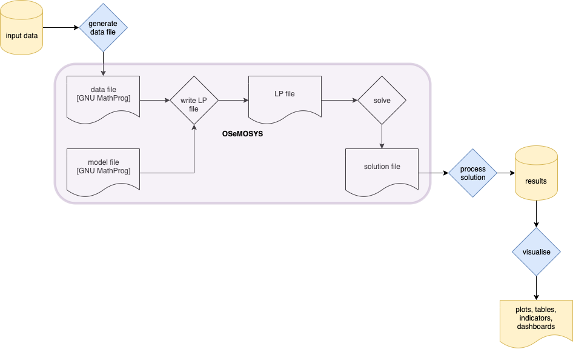

.. _functionality:

Introduction
------------

*otoole* is a command-line tool written in Python. By writing commands in a terminal
window, you can tell *otoole* to perform certain tedious tasks for you to turbo-charge
your OSeMOSYS modelling.

Initially, *otoole* only supports the GNU MathProg version of OSeMOSYS. We hope to build
support for other implementations of OSeMOSYS soon. In fact, this is one of the key aims
of *otoole* - to better link the various OSeMOSYS communities and their implementations
through common data standards and useful scripts and tools that we can work on together.

Core Functionality
------------------

As shown in the diagram, *otoole* deals primarily with data before and after OSeMOSYS.
We call the data work upto the generation of a datafile which is read in by GLPK
pre-processing.  Anything that happens with the immediate outputs of a solver, such as
the recommended open-source solvers GLPK, CBC, or the proprietary solvers CPLEX and Gurobi,
is called results and post-processing. You can find more information in the sections below.

Pre-processing
~~~~~~~~~~~~~~

*otoole* supports many data pre-processing conversions so as to ease the tasks of
the OSeMOSYS modeller.

At the centre of *otoole*'s recommended workflow is the use of the Tabular DataPackage
format (referred to as a ``datapackage`` to store the data for a model.
However, it is not required to use the datapackage format,
and instead *otoole* can be used to, for example,
convert an Excel workbook into a GNU MathProg datafile ready for processing with GLPK.
Note, however, that often the datapackage is used as an intermediate data format for more
complex transformations.

*otoole* currently supports conversion between the following formats:

- Excel
- Tabular DataPackage
- a folder of CSV files (identical to a datapackage, but without the metadata file)
- GNU MathProg datafile

``otoole convert``
==================

This command allows you to convert between various different input formats::

    $ otoole convert --help

    usage: otoole convert [-h]
                        {csv,datafile,datapackage,excel,sql}
                        {csv,datafile,datapackage,excel,sql} from_path to_path

    positional arguments:
    {csv,datafile,datapackage,excel,sql}
                            Input data format to convert from
    {csv,datafile,datapackage,excel,sql}
                            Input data format to convert to
    from_path             Path to file or folder to convert from
    to_path               Path to file or folder to convert to

    optional arguments:
    -h, --help            show this help message and exit

For example, to convert from an existing OSeMOSYS datafile, and create a Tabular Datapackage, you
use the following command::

    otoole convert datafile datapackage simplicity.txt simplicity

This creates the Tabular Datapackage in a folder called ``simplicity``.

Similarly, create an Excel workbook from a datafile::

    otoole convert datafile excel simplicity.txt simplicity.xlsx

And then convert it back again::

    otoole convert excel datafile simplicity.xlsx simplicity.txt

Results and Post-processing
~~~~~~~~~~~~~~~~~~~~~~~~~~~

With small OSeMOSYS models, it is normally fine to use the free open-source GLPK solver.
If you do, then OSeMOSYS will write out a full set of results as a folder of CSV files.
As you progress to larger models, the performance constraints of GLPK quickly become apparent.
CBC is an alternative open-source solver which offers better performance than GLPK and can handle
much larger models. However, CBC has no way of knowing how to write out the CSV files you were used
to dealing with when using GLPK.  *otoole* to the rescue!

*otoole* currently supports using CBC with all three versions of GNU MathProg OSeMOSYS
- the long, short and fast versions.

The long version includes all results as variables within the formulation,
so the ``otoole results`` command parses the CBC solution file,
extracts the required variables, and produces a folder of CSV files containing the results
in an identical format to if you had used GLPK.

The short and fast versions omit a large number of these calculated result variables
so as to speed up the model matrix generation and solution times.
As of PR #40 *otoole* now supports the majority of these calculated results so as to match
those produced by the long version of the code.

``otoole results``
==================

The ``results`` command creates a folder of CSV result files from a CBC solution file::

    $ otoole results --help

    usage: otoole results [-h] [--input_datapackage INPUT_DATAPACKAGE]
                        [--input_datafile INPUT_DATAFILE]
                        {cbc} {csv} from_path to_path

    positional arguments:
    {cbc}                 Result data format to convert from
    {csv}                 Result data format to convert to
    from_path             Path to file or folder to convert from
    to_path               Path to file or folder to convert to

    optional arguments:
    -h, --help            show this help message and exit
    --input_datapackage INPUT_DATAPACKAGE
                          Input data package required for OSeMOSYS short or fast
                          results
    --input_datafile INPUT_DATAFILE
                          Input GNUMathProg datafile required for OSeMOSYS short
                          or fast results

This is typically required when using the CBC solver with an LP file generated using
GLPK. For example::

    # Obtain the simplicity datafile from the Zenodo datapackage archive of the model
    otoole convert datapackage datafile https://zenodo.org/record/3479823/files/KTH-dESA/simplicity-v0.1a0.zip simplicity.txt
    # Create an LP file using glpsol
    glpsol -m osemosys_short.txt -d simplicity.txt --wlp simplicity.lp
    # Solve the model using CBC and write a CBC solution file
    cbc simplicity.lp solve -solu simplicity.sol

You're now ready to use otoole to generate a folder of CSV files from the CBC solution file::

    otoole results cbc csv simplicity.sol ./results --input_datafile simplicity.txt

*otoole* has duplicate Python methods for each of the result calculations performed in the long, short and fast OSeMOSYS
implementations (which are only used when using GLPK as a solver).

``otoole viz res``
==================

The ``viz`` command allows you to visualise a reference energy system (more visualisations to come)::

    $ otoole viz res --help

    usage: otoole viz res [-h] datapackage resfile

    positional arguments:
    datapackage  Path to model datapackage
    resfile      Path to reference energy system

    optional arguments:
    -h, --help   show this help message and exit

The ``resfile`` command should include a file ending used for images,
including ``bmp``, ``jpg``, ``pdf``, ``png`` etc. The ``graphviz`` library used to layout the
reference energy system will interpret the file ending.

For example::

    otoole viz res https://zenodo.org/record/3479823/files/KTH-dESA/simplicity-v0.1a0.zip res.png

will create a png file called ``res.png`` of the simplicity datapackage.
