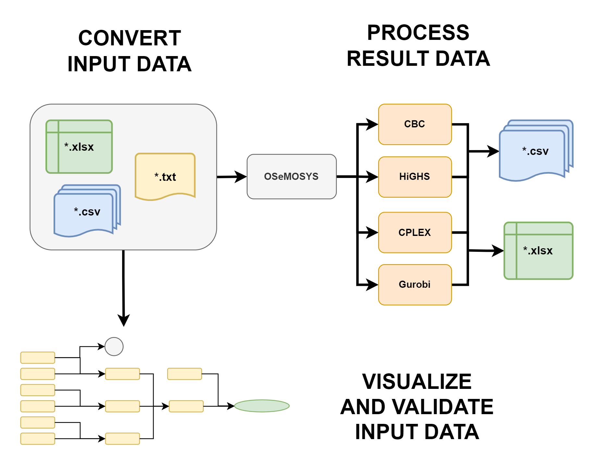

.. _welcome:

===========================================
Welcome to the documentation of ``otoole``!
===========================================

**otoole**, or **O**\ SeMOSYS **tool**\ s for **e**\ nergy work, is a Python package
which provides a command-line interface and Python API for users of OSeMOSYS. The aim of the
package is to provide commonly used pre- and post-processing steps when working with OSeMOSYS models.
Specifically, ``otoole`` allows the user to convert between data formats, process solutions,
and visualise the reference energy system.

Currently, ``otoole`` only supports the GNU MathProg version of OSeMOSYS. We hope to build
support for other implementations of OSeMOSYS soon. In fact, this is one of the key aims
of ``otoole`` - to better link the various OSeMOSYS communities and their implementations
through common data standards and useful scripts and tools that we can work on together.

Contents
========

.. toctree::
   :maxdepth: 1

   Getting Started <install>
   Core Functionality <functionality>
   Data Formats <data>
   Examples <examples>
   Python API <convert>
   Contributing <contributing>
   License <license>
   Authors <authors>
   Changelog <changelog>
   Module Reference <api/modules>

Indices and tables
==================

* :ref:`genindex`
* :ref:`modindex`
* :ref:`search`
