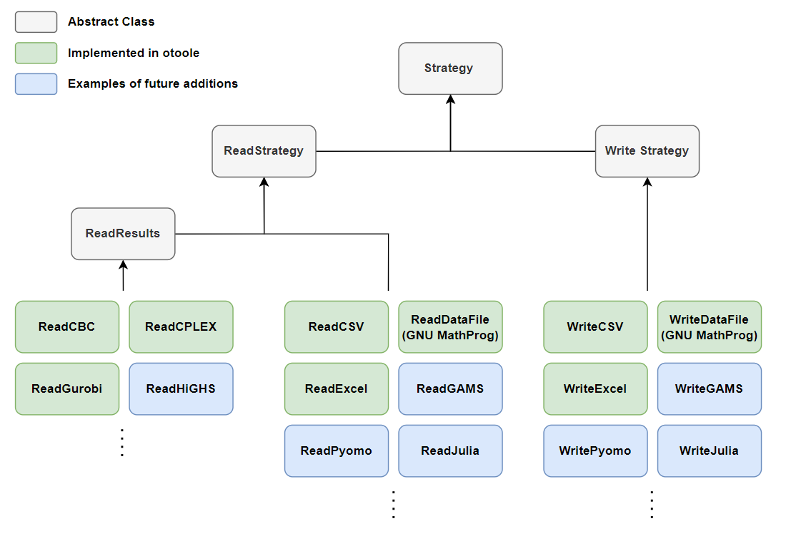

# Summary 

System level energy modelling tools are standard practice to evaluate 
decarbonization pathways, however, data handeling for the these models is 
becoming increasingly difficult. Depending on the workflow, user skill level, 
and model implementation, the data interfacing requirements can be significantly 
different. OSeMOSYS Tools for Energy Work, or otoole, is a Python package to 
assist OSeMOSYS energy modellers in handling input data, visualizing and validating 
their model data, and processing result data. otoole exposes three different 
data interfacing options to the user, and is structured to eaisly adapt to 
new interface methods and model implementations. 

# Statement of need 

The Open Source energy MOdelling SYStem, or OSeMOSYS [@howellsOSeMOSYSOpenSource2011], is a highly sighted and 
reputable open-souce framework for conducting long term energy planning studies. 
A popular implementation of OSeMOSYS is formulated in the mathematical 
programming language, GNU MathProg. While MathProg is open-source, fitting with 
the ethos of OSeMOSYS, it requires all data be stored in a single large and 
unwieldy text file. This results in data edits being tedious, error prone, and 
difficult to integrate into automated workflows. Furthermore, model result
files are often difficult to interface with unless some post-processing is first
done. There is a software gap for OSeMOSYS modellers to eaisly handle input 
data for the GNU MathProg implementation of OSeMOSYS, and process result files 
from standard solvers.

otoole solves this software gap through providing a command line interface to 
convert input data between different file formats and process result data. otoole
supports three different input file formats, wide formatted excel files (pivoted on 
the year index), long formatted CSV files, and GNU MathProg files. With 
otoole, users are able to eaisly convert between any of these formats to meet 
their skill level and workflow requirments. Furthermore, otoole can process 
result solution files from the open-source solver CBC [@forrestCoinorCbc2022], or the commercial solvers
Gurobi and CPLEX. 

Additionally, otoole allows users to visualize and validate their input data. 
Through the visualization functionality, users can automatically create a 
reference energy system; this is a common step in energy modelling where 
a schematic is used to visualize the flow of energy. Moreover, if the input
data follows a standardized naming scheme, the user can validate the data 
to quickly identify improperly named technologies and commodities, and ensure 
all energy paths are complete. 

# Publications

otoole has been implemented in various published research projects. A pedelogical focused 
paper on conducting global sensitivity analysis in the context of energy 
systems [@usherGlobalSensitivityAnalysis2023] uses otoole to automatically convert data for hundreds of simultanous 
model runs. OSeMOSYS Global [@barnesOSeMOSYSGlobalOpensource2022], an open-source global electricity system model 
generator, uses otoole in its data pipeline to programatically create unique 
OSeMOSYS models based on user inputs. 

* Add at least one more where me/Will are not first/second author 

# Extendability 

While otoole was originally created to assist MathProg OSeMOSYS modellers, it's 
functionality extends to other impelemtations of OSeMOSYS and any workflow
that uses MathProg data files. This is due to otoole following the a 
strategy pattern and storing all data in a standard format. 

The core design of otoole are the abstract base classes of ReadStrategy and 
WriteStrategy. The ReadStrategy class will refer to a class that reads 
input data into otooles standard data structure; a dictionary of pandas 
dataframes, where the key is a string specifying the parameter or variable. 
Each input data format (CSVs, Excel, datafile) has it's own read class 
that implements logic to read in that specific data format. This same design 
pattern is carried over to the WriteStrategy class. The ReadResults abstract 
class inherits from the ReadStrategy class as this class is also responsible
for calculating intermediate results if required. A schematic of this 
design pattern is shown in Figure 1. 



The advantage of designing otoole around a strategy pattern is that it allows 
for the easy addition of new file formats and model implementations. For example, 
there are currently less used OSeMOSYS implementations written in Python and 
GAMS. New reading and writing classes can easily be added to add data conversion
into and out of these formats. This is especially useful for benchmarking 
each implementation of OSeMOSYS against one another to check for inconsistencies 
and measure performance. This same logic applies to the reading of results. For 
example, adding support for the new open-source solver HiGHS [@huangfuParallelizingDualRevised2018] is as easy as 
creating a new ReadHiGHS class which inherits from the ReadResults class. 

When converting between formats, the user supplies otoole with a configuration 
file that describes the parameters, sets, and variables in the model. This 
allows otoole to work with any OSeMOSYS file that has been modified to add in 
or remove parameters, variables, or sets. This can be particullarly useful for 
extensions of OSeMOSYS, such of the Climate, Land, Energy, and Water framework [@bazilianConsideringEnergyWater2011],
which adds new parameters to OSeMOSYS to include the other sectors. 
Moreover, otoole can be further generalized to work with any model MathProg file. 

# Installation and Example

otoole is deplyed to the Python Packaging Index (PyPI) and can be installed 
via pip

```bash
pip install otoole
```

A sample repository, titled Simplicity, holds a simple sample OSeMOSYS model 
to demonstrate the functionalities of otoole. Instructions on how to use the 
core functions of otoole can be found on under the [Core Functionality](https://otoole.readthedocs.io/en/latest/functionality.html)
tab of on the documentation site. Examples of each of the core functions can 
be found under the [Examples](https://otoole.readthedocs.io/en/latest/examples.html) tab on the documentation site.  

# References
