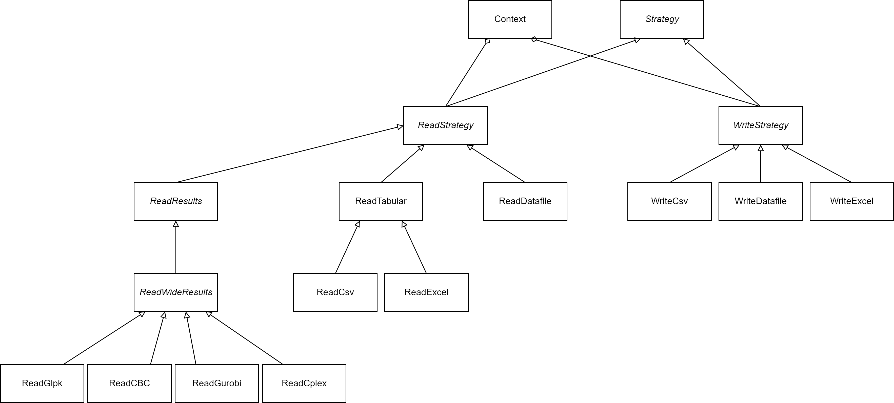

# Summary

Data handling for energy system optimisation models is a necessary but tedious task. Depending on the workflow, user skill level, and model implementation, the data interfacing requirements can be significantly different. OSeMOSYS Tools for Energy Work, or otoole, is a Python package providing OSeMOSYS energy modellers with options to use different input data formats, visualize and validate input data, and process result data. otoole exposes three different input data formats to the user, can process result data from four popular solvers, and is designed to be modular and extensible to enable interoperability between OSeMOSYS models developed in different programming languages.

# Statement of need

The Open Source energy MOdelling SYStem, or OSeMOSYS [@howells2011], is a highly cited and widely used open-source framework[^1] for conducting long-term energy system planning studies [@groissbock2019]. The original, and still highly used, implementation of OSeMOSYS is formulated in the mathematical programming language, [GNU MathProg](https://github.com/OSeMOSYS/OSeMOSYS_GNU_MathProg). While MathProg [@GNULinearProgramming2012] is open-source, fitting with the ethos of OSeMOSYS, it requires all data to be stored in a single large and unwieldy text file. Data edits to this file are tedious, error-prone, and difficult to integrate into automated workflows. Furthermore, model result files are often difficult to interface with unless processing work is first performed. In addition to the MathProg implementation, OSeMOSYS has also been formulated in [PuLP](https://github.com/OSeMOSYS/OSeMOSYS_PuLP), [Pyomo](https://github.com/OSeMOSYS/OSeMOSYS_Pyomo), [Julia JUMP](https://github.com/sei-international/NemoMod.jl) and [GAMS](https://github.com/OSeMOSYS/OSeMOSYS_GAMS). A software gap exists to provide OSeMOSYS modellers with an easy way to work with different input data formats and process result files.

[^1]: A SCOPUS search for “TITLE-ABS-KEY ( osemosys ) AND LANGUAGE ( english )” returned 81 results between 2018 to 2023. Moreover, the original OSeMOSYS paper [@howells2011] has over 440 citations in SCOPUS as of September 2023.

Compared to other open energy modelling frameworks that are based around a single (Python) implementation, such as PyPSA [@pypsa2018] and Calliope [@Pfenninger2018], the OSeMOSYS framework does not have standard data processing functions. For example, in PyPSA, users instantiate a `Network` object which has methods to import data (from various formats such as CSV, netCDF, and pypower), manipulate data, build and solve the model, and export results. In contrast, users of OSeMOSYS are required to prepare the input data and process results data themselves. otoole addresses the need in the OSeMOSYS community to standardize data handling functions across multiple different model implementations.

otoole supports three different input file formats: wide-format Excel files (pivoted on the year index), long-format CSV files, and GNU MathProg files. With otoole, users can convert between any of these formats to meet their skill level and workflow requirements. Furthermore, otoole can process result solution files from the open-source solvers GLPK [@GNULinearProgramming2012] and CBC [@forrest2022], and the commercial solvers Gurobi [@gurobioptimizationllcGurobiOptimizerReference2022] and CPLEX [@ibmCPLEXUsersManual2022], into tabulated CSV results.

Additionally, otoole can visualize and validate input data. Through the visualization function, users can create a reference energy system from their input data, as shown in \autoref{fig:res}; this is a common step in energy modelling where a schematic is used to visualize the flow of energy. Moreover, if the input data follows a standardized naming scheme, the user can validate input data to quickly identify improperly named technologies and commodities and ensure energy flow paths are complete.


# Publications

The development of otoole was originally mentioned in [@niet2021] through a discussion on consolidating and standardising scripts and data formats within the OSeMOSYS community. Since then, otoole has grown and been implemented in various published research projects. A paper on conducting global sensitivity analysis in the context of energy systems [@usher2023] uses otoole to convert data for hundreds of simultaneous OSeMOSYS model runs. OSeMOSYS Global [@barnes2022], an open-source global electricity system model generator, uses otoole in its workflow to programmatically create unique OSeMOSYS models based on user inputs. Finally, [@Ramos2022] mentions otoole in a paper discussing how to use OSeMOSYS to perform climate, land, energy, and water system modelling.

# Extensibility

While otoole was originally created to assist MathProg OSeMOSYS modellers, its functionality can easily extend to other implementations of OSeMOSYS, and any workflow that uses non-OSeMOSYS MathProg data files.

otoole follows a strategy design pattern [@gamma1994, p.315]. Two abstract base classes define how otoole reads and writes data, named ReadStrategy and WriteStrategy respectively. The ReadStrategy class reads model data or result data into an internal data structure (currently a dictionary of pandas DataFrames). While the WriteStrategy class writes out data to a format specified by the user. The ReadResults abstract class is responsible for calculating intermediate results if required. A schematic of this design pattern is shown in \autoref{fig:design-pattern}.



The advantage of designing otoole around a strategy pattern is that it allows for the easy addition of new file formats and model implementations. For example, there are existing OSeMOSYS implementations written in Python and GAMS, and new implementations may be created in the future. New reading and writing classes can easily add data conversion into and out of these formats. This is especially useful for benchmarking each implementation against one another to check for inconsistencies, measure performance, or to migrate OSeMOSYS models from one format to another. This same extensibility logic applies to the reading of results. For example, support for the new open-source solver, HiGHS [@huangfu2018], can be added through a class that inherits from ReadResults and implements reading logic specific to HiGHS.

When converting between formats, the user supplies otoole with a configuration file that describes the parameters, sets, and variables in the model. This allows otoole to work with any version of OSeMOSYS regardless of the model's parameters, sets, or variables. This is particularly useful for extensions of OSeMOSYS, such of the Climate, Land, Energy, and Water framework [@bazilian2011], which adds parameters to OSeMOSYS to represent other energy sectors. Moreover, describing the model through a configuration file allows otoole to work with any MathProg model file; not just OSeMOSYS models.

# Installation and Example

otoole is [published](https://pypi.org/project/otoole/) to the Python Packaging Index (PyPI) and can be installed via pip

```bash
pip install otoole
```

A sample repository, titled [Simplicity](https://github.com/OSeMOSYS/simplicity), holds a simple OSeMOSYS model to demonstrate the functionalities of otoole. Instructions on the core functions of otoole, in addition to examples using otoole through the command line and through the Python API can be found on the [documentation site](https://otoole.readthedocs.io/en/latest/).

# References
